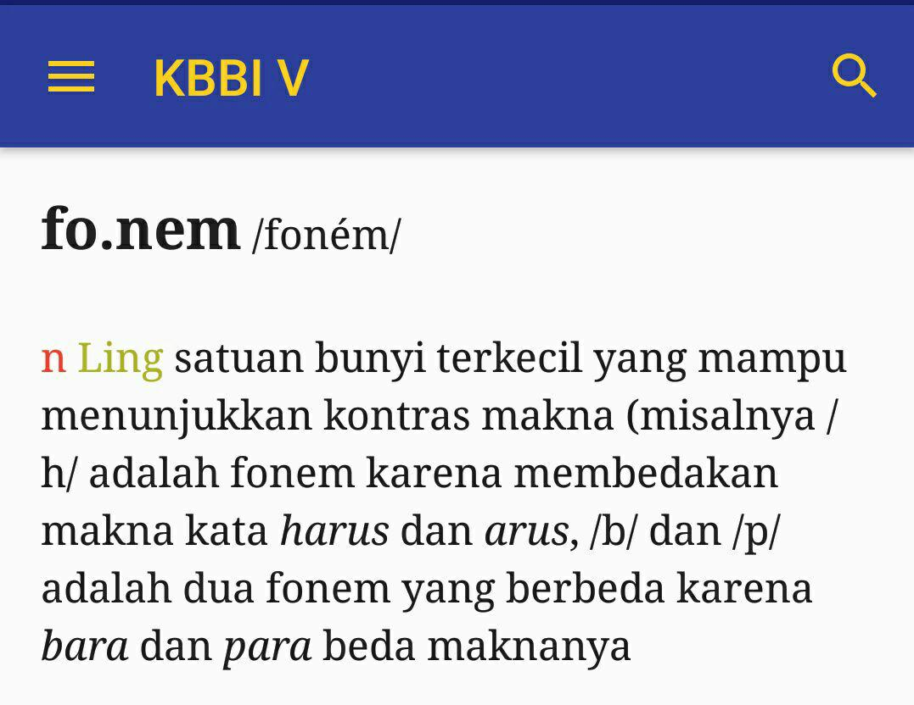

# Original post
[Artikel](http://semangatkecil.blogspot.com/2018/09/menelisik-komponen-kebahasaan-untuk.html)

# Unsur kebahasaan 
1. Wacana : n Ling satuan bahasa terlengkap yang direalisasikan dalam bentuk karangan atau laporan utuh, seperti novel, buku, artikel, pidato, atau khotbah
1. Paragraf : n bagain bab dalam suatu karangan (biasanya mengandung satu ide pokok dan penulisannya dimulai dengan garis baru); alinea
1. Kalimat : n Ling satuan bahasa yang secara relatif berdiri sendiri, mempunyai pola intonasi final dan secara aktual ataupun potensial terdiri atas klausa
1. Klausa : n Ling satuan gramatikal yang mengandung predikat dan berpotensi menjadi kalimat
1. Frasa : n Ling gabungan dua kata atau lebih yang bersifat non predikatif (misalnya gunung tinggi disebut frasa karena merupakan konstruksi nonpredikatif)
1. Kata : n Ling satuan bahasa yang dapat berdiri sendiri, terjadi dari morfem tunggal (misalnya batu, rumah, datang) atau gabungan morfem (misalnya pejuang, pancasila, mahakuasa)
1. Morfem : n Ling suatu bentuk bahasa terkecil yang mempunyai makna secara relatif stabil dan tidak dapat dibagi atas bagian bermakna yang lebih kecil
1. Silabel : n Ling suku kata
1. Fonem : n Ling satuan bunyi terkecil yang mampu menunjukkan kontras makna (misalnya / h/ adalahfonem karena membedakan makna kata harus dan arus, /b/ dan /p/ adalah dua fonem yang berbeda karena bara dan para beda makna.

# Fonem Bahasa Indonesia
| No  |      Google Site       |      Tata bahasa baku B.Ind    |  33 fonem B.Ind   |   |     | pelafalan  |   contoh (tulis)  | contoh (lafal) |
|:----------------------:|:-----------:|:--------------------------:|:--------------:|---|-----------|--------------------------|-----------------------------| ---|
|                      |  | |  | |  | | |  |            |               |
|            1           |      a      |              a             |        a       | | |     a     |      air adik kanvas     |    /air/ /adik/ /kanvas/    |
|            2           |      au     |                            |       aw       | | |     aw    |        kalau - kau       |       /kalaw/ - /kaw/       |
|            3           |      ai     |                            |       ay       | | |     ay    |         intai - -        |         /intay/ - -         |
|            4           |      b      |              b             |        b       | | |     b     |     bukan baru bantal    |   /bukan/ /baru/ /bantal/   |
|            5           |      c      |              c             |        c       | | |     c     |      cara cari cinta     |    /cara/ /cari/ /cinta/    |
|            6           |      d      |              d             |        d       | | |     d     |      damai duta dua      |     /damay/ /duta/ /dua/    |
|            7           |      e      |              e             |        e       | | |     e     |      enak sore sepak     |    /enak/ /sore/ /sepak/    |
|            8           |      e      |              e             |       e2       | | |     ε     |     nenek leleh bebek    |   /nεnε?/ /lεlεh/ /bεbεk/   |
|            9           |      e      |              e             |       e3       | | |     ∂     |    gedung besar tepung   |   /g∂duŋ/ /b∂sar/ /t∂puŋ/   |
|           10           |             |                            |       ei       | | |     ey    |          - - mei         |          - - /mey/          |
|           11           |      f      |              f             |        f       | | |     f     |    formal fakta falak    |   /formal/ /fakta/ /falak/  |
|           12           |      g      |              g             |        g       | | |     g     |      gundul ragu gua     |    /gundul/ /ragu/ /gua/    |
|           13           |      h      |              h             |        h       | | |     h     |     harap hari hirup     |    /harap/ /hari/ /hirup/   |
|           14           |             |              h             |                | | |     ħ     |         - - lihat        |            /liat/           |
|           15           |      i      |              i             |        i       | | |     i     |     indah tari bijak     |    /indah/ /tari/ /bijak/   |
|           16           |      I      |              I             |                | | |     I     |      kering tarik -      |      /keriŋ/ /tari?/ -      |
|           17           |      j      |              j             |        j       | | |     j     |   jumlah juga jangkrik   |  /jumlah/ /juga/ /jaŋkrik/  |
|           18           |      k      |              k             |        k       | | |     k     |     kasih sukar kota     |    /kasih/ /sukar/ /kota/   |
|           19           |      k      |              k             |                | | |     ?     |      rakyat rusak -      |     /ra?yat/ /rusak/ -      |
|           20           |             |              k             |                | | |     k'    |        - - politik       |        - - /politik'/       |
|           21           |      l      |              l             |        l       | | |     l     |     lama palsu lempar    |   /lama/ /palsu/ /lempar/   |
|           22           |      m      |              m             |        m       | | |     m     |     mandi makan minum    |   /mandi/ /makan/ /minum/   |
|           23           |      n      |              n             |        n       | | |     n     |     nanas nakal nihil    |   /nanas/ /nakal/ /nihil/   |
|           24           |      ny     |             ny             |       ny       | | |     ñ     |    nyanyi nyiur banyak   |    /ñañi/ /ñiur/ /bañak/    |
|           25           |      ng     |             ng             |       ng       | | |     ŋ     |  barang pangkat ngengat  |   /baraŋ/ /paŋkat/ /ŋ∂ŋat/  |
|           26           |      o      |              o             |                | | |     o     |         obat toko        |        /obat/ /toko/        |
|           27           |      o      |              o             |        o       | | |     O     |     tolong tokoh bola    |   /tOlong/ /tokOh/ /bOla/   |
|           28           |      oi     |             oi             |       oi       | | |     oy    |      amboi sekoi koi     |    /amboy/ /sekoy/ /koi/    |
|           29           |      p      |              p             |        p       | | |     p     |     pilih pintu pupus    |   /pilih/ /pintu/ /pupus/   |
|           30           |             |              p             |                | | |     p    |         - sedap -        |         - /sedap/ -         |
|           31           |      r      |              r             |        r       | | |     r     |    rantai raja rombak    |   /rantai/ /raja/ /rombak/  |
|           32           |      s      |              s             |        s       | | |     s     |      suara sama siku     |    /suara/ /sama/ /siku/    |
|           33           |      sy     |             sy             |       sy       | | |     š     | syukur masyarakat syukur | /šukur/ /mašarakat/ /šukur/ |
|           34           |      t      |              t             |        t       | | |     t     |     taruh timpa timpa    |   /taruh/ /timpa/ /timpa/   |
|           35           |             |              t             |                | | |     t'    |        - lompat -        |        - /lompat'/ -        |
|           36           |      u      |              u             |        u       | | |     u     |      ulir cucu ukur      |     /ulir/ /cucu/ /ukur/    |
|           37           |      u      |              u             |                | | |     U     |      taruh rapuh -       |      /tarUh/ /rapUh/ -      |
|           38           |      v      |                            |                | | |     v     |         visa - -         |          /visa/ - -         |
|           39           |      w      |              w             |        w       | | |     w     |    wanita waktu wangi    |   /wanita/ /waktu/ /wangi/  |
|           40           |      kh     |             kh             |       kh       | | |     x     |      ikhwal khas -       |       /ixwal/ /xas/ -       |
|           41           |      y      |              y             |        y       | | |     y     |     karya yakin yakin    |   /karya/ /yakin/ /yakin/   |
|           42           |      z      |                            |        z       | | |     z     |      ijazah - zaman      |       /ijazah/ - zaman      |

# Transformasi fonem
|  |            |       |                                                  |                                        |
|:------------------------------------:|------------|-------|--------------------------------------------------|----------------------------------------|
|                  No                  |    Huruf   | Bunyi |                    contoh baca                   |              contoh tulis              |
| 1                                    |      b     |  [b]  | /baru/,/tambal/                                  | baru, tambal                           |
|                                      |            |  [pֿ] | /adap ֿ/, /pәradaban/                            | adab, peradaban                        |
| 2                                    |      c     |  [c]  | /cari/, /pici/, /caciη/, /pincaη/                | cari, pici, cacing, pincang            |
| 3                                    |      d     |  [d]  | /duta/, /madu/                                   | duta, madu                             |
|                                      |            |  [t’] | /tekat’/,/abat’//murtat’/, /kәmurtadan/          | tekad, abad,murtad, kemurtadan         |
| 4                                    |      f     |  [f]  | /fakta/, /fajar/, /kafir/, /fariasi/, /telefisi/ | fakta, fajar, kafir, variasi, televisi |
| 5                                    |      g     |  [g]  | /gula/, /ragu/                                   | gula, ragu                             |
|                                      |            |  [k]  | /bәduk/, /gudәk/, /kәajәgan/,/ kәajәkan/         | bedug, gudeg, keajegan                 |
| 6                                    |      h     |  [h]  | /hari/, /rumah/, /murah/                         | hari, rumah, murah                     |
|                                      |            |  [ħ]  | /tau/, /liat/                                    | tahu, lihat                            |
| 7                                    |      j     |  [j]  | /juga/, /maju/, /mi?raj/                         | juga, maju, mikraj                     |
| 8                                    |      k     |  [k]  | /kuraη/,/sukar/                                  | kurang, sukar                          |
|                                      |            |  [k’] | /politik’/                                       | politik                                |
|                                      |            |  [?]  | /rusa?/, /tida?/                                 | rusak, tidak                           |
| 9                                    |      l     |  [l]  | /lama/, /palsu/, /aspal/                         | lama, palsu, aspal                     |
| 10                                   |      m     |  [m]  | /makan/, /sampay/, /malam/                       | makan, sampai, malam                   |
| 11                                   |      n     |  [n]  | /nakal/, /pantay/, /ikan/                        | nakal, pantai, ikan                    |
| 12                                   |     ny     |  [ň]  | /ňiur/, /ňaňian/, /m ňalin/                      | nyiur, nyanyian, menyalin              |
| 13                                   |     ng     |  [η]  | /ηaray/, /paηkat/, /paliη/                       | ngarai, pangkat, paling                |
| 14                                   |      p     |  [p]  | /pintu/, /sampay/                                | pintu, sampai                          |
|                                      |            |  [p] | /tatap/, /sәdap/                               | tatap, sedap                           |
| 15                                   |      r     |  [R]  | /Raja/, /kaRya/, /pasaR/, /kәmaRin/              | raja, karya, pasar, kemarin            |
| 16                                   |      s     |  [s]  | /sama/, /malas/, /pasti/, /saraf/                | sama, malas, pasti, saraf              |
| 17                                   |     sy     |  [š]  | / šukur/, /mašarakat/, /ašik/                    | syukur, masyarakat, asyik              |
| 18                                   |      t     |  [t]  | /timpa/, /santay/                                | timpa, santai                          |
|                                      |            |  [t’] | /lompat’/,/tәmpat’/                              | lompat, tempat                         |
| 19                                   |      w     |  [w]  | /waktu/, /warna/, /kalaw/, /walawpun/            | waktu, warna, kalau, walaupun          |
| 20                                   |     kh     |  [x]  | /xas/, /axir/, /tarix/, /xawatir/                | khas, akhir, tarikh, khawatir          |
| 21                                   |      y     |  [y]  | /yakin/, /yakni/, /santay/, /ramay/              | yakin, yakni, santai, ramai            |
| 22                                   |      z     |  [z]  | /zat/, /zәni/, /izin/                            | zat, zeni, izin                        |
| 23                                   | glotal /?/ |  [?]  | /bapa?/, /ma?af?, /i?in/, /cәmo?oh/              | bapak, maaf, iin, cemooh               |

# Gugus
|    |       |                                        |
|----|-------|----------------------------------------|
| No | Gugus | Contoh                                 |
| 1  | /pl/  | pleonasme, pleno, kompleks, taplak     |
| 2  | /bl/  | blangko, Blambangan, gemblang          |
| 3  | /kl/  | klinik, klimaks, klasik                |
| 4  | /gl/  | global, gladiator, isoglos             |
| 5  | /fl/  | flamboyan, flanel, flu                 |
| 6  | /sl/  | slogan, slipi                          |
| 7  | /pr/  | pribadi, April, semprot                |
| 8  | /br/  | brahma, obral, ambruk                  |
| 9  | /tr/  | tragedi, sastra, mitra                 |
| 10 | /dr/  | drama, adres, drastis                  |
| 11 | /kr/  | kristen, akrab, krupuk, mikroskop      |
| 12 | /gr/  | gram, granat, grafik                   |
| 13 | /fr/  | fragmen, diafragma, frustasi           |
| 14 | /sr/  | pasrah, Sragen, Sriwijaya              |
| 15 | /ps/  | psikologi, psikiater, psikolog, pseudo |
| 16 | /ks/  | ekstra, eksponen                       |
| 17 | /dw/  | dwifungsi, dwiwarna, dwibahasa         |
| 18 | /sw/  | swalayan, swasembada, swasta           |
| 19 | /kw/  | kuintal, kuitansi                      |
| 20 | /sp/  | spora, spanduk, sponsor                |
| 21 | /sm/  | smokel                                 |
| 22 | /sn/  | snobisme                               |
| 23 | /sk/  | skala, skema, skandal                  |

# Deret vokal
|  |             |                                                   |
|:-----------:|-------------|---------------------------------------------------|
|      No     | Deret Vokal |                       Contoh                      |
| 1           | /i u/       | /tiup/  tiup  /iur/  iur  /ňiur/  nyiur           |
| 2           | /i o/       | /kios/  kios  /radio/  radio  /biola/  biola      |
| 3           | /i a/       | /tiap/  tiap  /dia/  dia  /giat/  giat            |
| 4           | /e i/       | /mei/ Mei                                         |
| 5           | /e a/       | /beasiswa/ beasiswa /kreasi/ kreasi               |
| 6           | /e o/       | /feodal/  feodal  /beo/  beo  /pemeo/  pemeo      |
| 7           | /a e/       | /daerah/ daerah                                   |
| 8           | /a i/       | /sainan/  saingan  /mainan/  mainan  /kain/  kain |
| 9           | /a u/       | /kaum/  kaum  /tau/  tahu  /mau/  mau             |
| 10          | /o a/       | /soal/ soal /doa/ doa                             |
| 11          | /u i/       | /kuil/  kuil  /buih/  buih                        |
| 12          | /u a/       | /dua/  dua  /puasa/  puasa  /suap/  suap          |
| 13          | /u e/       | /kue/  kue  /duet/  duet                          |
| 14          | /u o/       | /kuota/ kuota                                     |
| 15          | /ә i/       | /sәikat/ seikat                                   |
| 16          | /ә e/       | /sәekor/ seekor                                   |
| 17          | /ә a/       | /sәakan/ seakan                                   |
| 18          | /ә u/       | /sәutas/ seutas                                   |
| 19          | /ә o/       | /sәoraη/ seorang                                  |
| 20          | /ә ә/       | /kәәnam/ keenam                                   |

# Deret konsonan
|  |                |                              |    |                |                                 |
|:-----:|----------------|------------------------------|----|----------------|---------------------------------|
|   No  | Deret Konsonan |            Contoh            | No | Deret Konsonan |              Contoh             |
| 21    | /m p/          | empat, pimpin, tampuk        | 51 | /? w/          | dakwa, dakwah, takwa            |
| 22    | /m b/          | ambil, gambar, ambang        | 52 | /p t/          | sapta, optik, baptis            |
| 23    | /n t/          | untuk, ganti, pintu          | 53 | /h t/          | sejahtera, tahta, bahtera       |
| 24    | /n d/          | indah, pendek, pandang       | 54 | /h k/          | bahkan                          |
| 25    | /ň c/          | lancar, kunci, kencang       | 55 | /h š/          | dahsyat                         |
| 26    | /ň j/          | janji, banjir, panjang       | 56 | /h b/          | sahbandar, tahbis               |
| 27    | /η k/          | engkau, mungkin, bungkuk     | 57 | /h l/          | ahli, mahligai, tahlil          |
| 28    | /η g/          | angguk, tinggi, tanggung     | 58 | /h y/          | sembahyang                      |
| 29    | /η s/          | insaf, insang                | 59 | /h w/          | bahwa, syahwat                  |
| 30    | /η s/          | bangsa, angsa, mangsa        | 60 | /s h/          | mashur                          |
| 31    | /r b/          | kerbau, korban, terbang      | 61 | /m r/          | jamrut                          |
| 32    | /r d/          | merdeka, merdu, kerdil       | 62 | /m l/          | jumlah, imla                    |
| 33    | /r g/          | harga, pergi, sorga          | 63 | /l m/          | ilmu, gulma, palma              |
| 34    | /r j/          | kerja, terjang, sarjana      | 64 | /g n/          | signal, kognitif                |
| 35    | /r m/          | permata, cermin, derma       | 65 | /n p/          | tanpa                           |
| 36    | /r n/          | warna, purnama, ternak       | 66 | /r h/          | gerhana, durhaka                |
| 37    | /r l/          | perlu, kerling, kerlip       | 67 | /s b/          | asbak, asbes, tasbih            |
| 38    | /r t/          | arti, serta, harta           | 68 | /s p/          | puspa, puspita, aspirasi, aspal |
| 39    | /r k/          | terka, perkara, murka        | 69 | /s m/          | basmi, asmara, resmi            |
| 40    | /r s/          | bersih, kursi, gersang       | 70 | /k m/          | sukma                           |
| 41    | /r c/          | percaya, karcis, percik      | 71 | /l s/          | palsu, pulsa, filsafat, balsem  |
| 42    | /s t/          | isteri, pasti, kusta, dusta  | 72 | /j l/          | salju, aljabar                  |
| 43    | /s l/          | asli, tuslah, beslit, beslah | 73 | /l t/          | sultan, salto, simultan         |
| 44    | /k t/          | waktu, dokter, bukti         | 74 | /p d/          | sabda, abdi                     |
| 45    | /k s/          | paksa, laksana, saksama      | 75 | /g m/          | magma, dogma                    |
| 46    | /? d/          | takdir                       | 76 | /h d/          | syahdan, syahdu                 |
| 47    | /? n/          | laknat, makna, yakni         |    |                |                                 |
| 48    | /? l/          | takluk, maklum, taklimat     |    |                |                                 |
| 49    | /? r/          | makruf, takrif               |    |                |                                 |
| 50    | /? y/          | rakyat                       |    |                |                                 |

# Format silabel
|  |        |                                        |
|:-------------------------------:|:------:|:--------------------------------------:|
|                No               | Format |                 Contoh                 |
| 1                               | V      | /a/-ku                                 |
| 2                               | KV     | /bu/-ku, /ra/-gam, /se/-petu, /ra/-nun |
| 3                               | VK     | /im/-an, /in/-dah, /ar/-sip, /un/-tung |
| 4                               | VKK    | /Eks/-perimen                          |
| 5                               | KKV    | /Kli/-maks, /kla/-sik                  |
| 6                               | KVK    | in-/dah/, struk-/tur/, /gel/-ap        |
| 7                               | KKVK   | /prak/-tis, transmi-/gran/             |
| 8                               | KKKVK  | /struk/-tur                            |
| 9                               | KKVKK  | /trans/-migrasi                        |
| 10                              | KVKKK  | /korps/                                |
| 11                              | KKKV   | in-/stru/-men                          |

# Source
[Sumber](http://semangatkecil.blogspot.com/2018/09/menelisik-komponen-kebahasaan-untuk.html) lihat bagian akhir artikel
